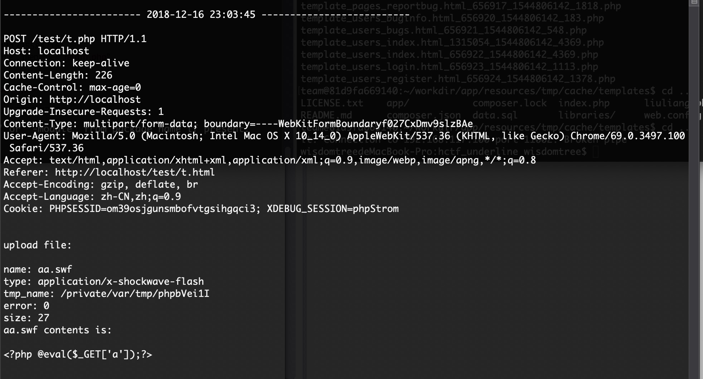

# WisdomTree_Log

> 写这个工具的起因是，在某次线下赛中我居然在没有流量的情况下打了两天的awd。头都被别人打烂了。。。。以往我们自己打比赛时，都是用学长写的流量抓取工具，后来这个工具也找不到了。网上也有多功能齐全的日志捕获工具，但是都太繁琐。我一直认为越简单的东西，越不容易出错，因此我自己写了一个小工具。原理也简单，就是仿burp的流量格式，获取每一次请求的流量。前提是web目录下每一个php文件都包含我的log.php。基于此，我顺手也写了一个php的批量包含脚本。

### 使用方法

使用前提：`\tmp`目录可写，若要修改日志文件存储路径，则手动修改`log.php`中的`$log_dir`。

1、将`log.php`和`include_all.php`拷贝到web根目录下（或者框架根目录下）。  
2、运行`php include_all.php && rm -rf include_all.php`，递归包含`log.php`。  
3、访问网站，流量会自动写入`/tmp`目录。文件名为`年_月_日-时`，每小时新建一个日志文件。

### 使用效果

